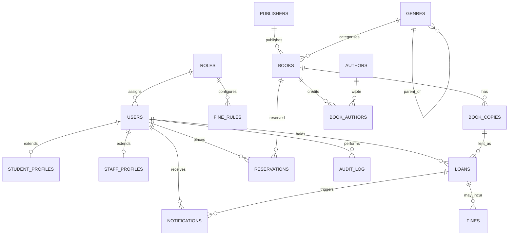

# Library System — Project Context

**Last updated:** 2026-06-06 (fresh restart under IB-textbook OOP conventions)
**Purpose:** Private reference doc for Oskar + Claude. Not part of the IA submission. Pasted into fresh AI sessions to provide full project context without re-explaining.

> **Changelog 2026-06-06 (restart):** Code wiped and being rebuilt from scratch to follow the IB CS course-text conventions (Hodder, Baumgarten/Ganea/Turland, B2-B3): OOP-first designed from UML class diagrams, encapsulation with private attributes + accessor/mutator methods, the book's naming rules. See CONVENTIONS.md. Design decisions are retained (schema, eligibility view, seed methodology); only the code is rebuilt, and git history is kept for authorship evidence.

> **Changelog 2026-06-06:** Phase 1 done — schema (17 tables + view), `db/connection.py`, and a tested synthetic-data seeder built and pushed. Schema section below corrected to match the implemented `db/schema.sql` (column/enum renames). Python confirmed 3.13.6. `db/schema.sql` is now the source of truth for exact names — this doc follows it, not the reverse.

> **Changelog 2026-06-05:** international school (was "Polish, Łódź"); fixed eligibility view (COUNT DISTINCT); SC4 cap = per-role max (was replacement cost); 7 form groups years 7-11+IB1+IB2 (was 5); added currency (PLN), naming/email conventions, computed-overdue rule; code rebuilt from scratch; IA structure now governed by IB_CS_IA_Pre_Planning_Sheet.pdf.

---

## ⚡ For a fresh Claude session — read this first

This file contains everything you need to help me on this project. Before answering any question:

1. **Read the "At a glance" section below** to understand what we're building and where we are.
2. **Check "Open decisions"** — anything I ask about may relate to one of these.
3. **Check "Things NOT to do"** — there are decisions already made that should not be re-litigated.
4. **Don't re-explain things from this doc** unless I explicitly ask. Assume I've read it.
5. **Default to the build plan order** — if I ask for help on a feature out of sequence, gently ask whether prerequisites are done before diving in.

If something in this doc seems inconsistent or out of date, flag it. The timestamp at the top is the source of truth for freshness.

---

## At a glance

- **What:** Library Management System for my high school library.
- **Why:** No automated system currently exists. Students keep books indefinitely, librarian can't make data-driven purchasing decisions.
- **For:** IB Computer Science IA, 2027 session. Internal Assessment counts 30% (SL) / 20% (HL) of final grade.
- **Constraints:** 35 hours total build budget; 2,000-word IA documentation limit; 5-minute demo video.
- **Marking:** 30 marks across Criteria A–E (A=4, B=4, C=6, D=12, E=4). Targeting 27–30/30.
- **Tech stack:** Python 3.13.6 (stdlib), PySide6 UI, SQLite database, Google Books API, SMTP via Gmail app password.
- **Repo:** `OskarElliott/Library-Management-System` (GitHub). Layered layout: `db/`, `models/`, `services/`, `ui/`, `tests/`, plus `generate_synthetic_data.py` at root.
- **Current phase:** Fresh restart. Code rebuilt from scratch under the IB-textbook OOP conventions (see CONVENTIONS.md). Design decisions retained. Beginning Phase 0/1 again.

---

## Resolved decisions & conventions (2026-06-05)

- **IA structure is governed by IB_CS_IA_Pre_Planning_Sheet.pdf** (in project knowledge) — that document is authoritative for criteria, mark split, and per-criterion word budgets. Client/end-user consent IS required per that sheet; keep the librarian-as-client framing.
- **Currency:** PLN for all replacement costs and fines.
- **Fine cap:** the per-role flat `FineRules.max_amount` (NOT the book's replacement cost).
- **Overdue is computed** from due_date vs current date, never stored. Allowed `Loans.status` values: active, returned, lost.
- **Naming:** usernames are `firstname.lastname` (lowercase, `.2`/`.3` on collision); emails `username@school.edu`. `Users` has no name columns — display name is derived from the username.
- **Seed data:** single shared dev password for all seed users; mixed international names; generic term-break calendar (not country-specific public holidays).
- **Scope:** secondary years 7-11 plus IB1 and IB2 = 7 form groups, one class per year (schema must stay flexible for a future A/B split). Primary years 1-6 are excluded.

---

## Stakeholders

- **Builder:** Oskar (IB student). International school.
- **Primary user / client:** head librarian. Operates the system at the front desk.
- **Secondary users:** teaching staff (analytics access, longer loan periods), students (reservations, recommendations, optional self-service borrow lookup).
- **Consent status:** real client consent and interview deferred until after the prototype is functional. For now requirements are derived from observed library workflows and supervisor guidance. Formal interview and signed consent must happen before final submission.

---

## Tech stack & justifications

| Component | Choice | Why |
|---|---|---|
| Language | Python 3.13.6 (confirmed on dev machine) | Mature stdlib, broad library support, IB-familiar |
| UI | PySide6 (LGPL, free) | Native animations via QPropertyAnimation, QSS theming, signal/slot architecture (= Observer pattern), QAbstractTableModel for data binding. Switched from CustomTkinter because of aesthetics ceiling. |
| Database | SQLite (stdlib `sqlite3`) | Zero-config, single-file, transactional, no separate server. Right size for single-user librarian-driven app. Limitation: serialises concurrent writes — would need PostgreSQL for school-wide concurrent access. |
| Password hashing | `bcrypt` | Industry standard, salted, adaptive cost factor. OWASP-recommended. |
| HTTP client | `requests` | Standard choice for the Google Books API call. |
| Numerical | `numpy` | Cosine similarity, regression via `polyfit`. |
| Charts | `matplotlib` | Demand-score visualisations. Also handles PDF export (`savefig`). |
| Email | `smtplib` (stdlib) + Gmail app password | Stdlib means no extra dependency. Gmail app password chosen over school SMTP for setup simplicity and off-network operation. |
| Calendar | Custom `SchoolCalendar` table | Manual entry by librarian. `.ics` import is nice-to-have, not core. |

**Not used (deliberately):**
- NetworkX / co-borrowing graph — cut from scope, reportlab — Matplotlib's `savefig` handles PDF.
- ORM (SQLAlchemy etc.) — direct `sqlite3` keeps complexity low and SQL skills visible to moderator.
- AsyncIO / threading — single-user desktop app, blocking is fine for the timing budgets.

---

## Success criteria (locked)

These are the final wordings. Do not re-litigate without good reason.

**SC1 — Authentication & RBAC:** Three roles authenticate via Bcrypt-hashed credentials within 2 seconds; each role enforces a distinct permission matrix.

**SC2 — Data Integrity & Security:** All passwords stored as Bcrypt hashes; all database queries use parameterised statements to prevent SQL injection; an audit log records administrative actions (user creation, book additions/removals, fine adjustments) with timestamp and user ID.

**SC3 — API Integration:** Given a valid 13-digit ISBN, Google Books metadata is fetched, parsed, and persisted within 3 seconds, with graceful fallback for invalid responses or API failures.

**SC4 — Circulation & Fine Enforcement:** A tiered fine system (3-day grace period, then escalating daily rates capped at the per-role maximum in `FineRules.max_amount`) is calculated automatically via a SQL view. Accounts with unpaid fines are blocked from new checkouts.

**SC5 — Demand Analytics:** A weighted demand score ranks genres by per-copy borrowing activity, giving more weight to recently borrowed books. A linear-regression model projects each genre's loan volume for the next term to support optimal purchasing decisions.

**SC6 — Modern UX:** UI transitions are smooth without visible lag or flickering. Any major view reachable in ≤2 clicks. Supports light and dark modes.

**SC7 — Reservation System:** Users can reserve books currently on loan. Reservations are queued by priority (staff before students, then FIFO). When a copy is returned, the next reservation is automatically notified by email and the copy is held for 48 hours before being released to the next user or returned to general availability.

**SC8 — Recommendations:** Each active student receives ≥5 personalised book recommendations distinct from previously borrowed titles. Users with <3 loans on record receive a fallback based on most-borrowed titles in their most common genre.

---

## Architecture

Layered separation:

```
┌──────────────────────────────────────────────┐
│ UI layer (PySide6)                           │
│  - Login window, main window, view frames    │
└──────────────────────────────────────────────┘
                    │ (signals/slots)
┌──────────────────────────────────────────────┐
│ Service layer                                │
│  - AuthService, BookService, LoanService,    │
│    FineService, ReservationService,          │
│    NotificationService, RecommenderService,  │
│    AnalyticsService                          │
└──────────────────────────────────────────────┘
                    │ (function calls)
┌──────────────────────────────────────────────┐
│ Persistence layer                            │
│  - db/connection.py (conn + init_db)         │
│  - db/schema.sql                             │
│  - SQL views (e.g. borrowing_eligibility)    │
└──────────────────────────────────────────────┘
                    │
              ┌─────┴─────┐
              ▼           ▼
        ┌──────────┐ ┌──────────────┐
        │ SQLite   │ │ External:    │
        │ library  │ │ Google Books │
        │   .db    │ │ SMTP (Gmail) │
        └──────────┘ └──────────────┘
```

**Rules:**
- UI calls services, never the database directly.
- Services mediate between UI and persistence.
- Single `NotificationService` used by both overdue alerts and reservation alerts.
- User class hierarchy: `User` (base) → `Student`, `Teacher`, `Librarian`. Each subclass overrides `can_borrow()`, `max_loan_days()`, `fine_rate()`.
- **Code style:** follow CONVENTIONS.md — OOP designed from UML class diagrams, encapsulated classes (private instance vars + accessor/mutator methods where outside code needs access), the IB-textbook naming rules. Classes are singular-noun PascalCase; methods are snake_case verbs.

---

## Database schema

### ER diagram source (Mermaid)



### Full table list (17 tables)

**Identity:** Roles, Users, StudentProfiles, StaffProfiles
**Catalogue:** Publishers, Genres, Authors, Books, BookAuthors, BookCopies
**Circulation:** Loans, Reservations
**Fines:** FineRules, Fines
**Operations:** SchoolCalendar, Notifications, AuditLog

### Key columns by table

> Source of truth is `db/schema.sql`. The summary below mirrors it; if they ever disagree, the file wins.

```sql
Roles(role_id PK, role_name UK, description)
Users(user_id PK, username UK, password_hash, role_id FK,
      email, created_at, is_active)
StudentProfiles(user_id PK/FK, year_number, homeroom, form_tutor_email)
  -- year_number: 7-11, with IB1/IB2 stored as 12/13
StaffProfiles(user_id PK/FK, subject)

Publishers(publisher_id PK, name UK, country)
Genres(genre_id PK, name UK, parent_genre_id FK→Genres)
Authors(author_id PK, first_name, last_name)
Books(book_id PK, isbn UK, title, publication_year,
      publisher_id FK, genre_id FK, description, replacement_cost)
BookAuthors(book_id FK, author_id FK, PRIMARY KEY composite)
BookCopies(copy_id PK, book_id FK, purchase_date, condition, status)
  -- status: 'available' | 'loaned' | 'reserved' | 'lost' | 'discarded'

Loans(loan_id PK, copy_id FK, user_id FK, checkout_date, due_date,
      return_date NULL, status)
  -- status: 'active' | 'returned' | 'lost' (overdue is computed, not stored)
Reservations(reservation_id PK, book_id FK, user_id FK, request_date,
             priority, status, notified_date NULL, expires_at NULL)
  -- priority: integer; lower = higher priority (staff=1, student=2)
  -- status: 'pending' | 'ready' | 'fulfilled' | 'expired' | 'cancelled'

FineRules(rule_id PK, role_id FK UNIQUE, grace_days, tier_1_rate,
          tier_2_rate, max_amount)
Fines(fine_id PK, loan_id FK, amount, issued_date,
      paid_date NULL, status)
  -- status: 'unpaid' | 'paid' | 'cancelled'

SchoolCalendar(day_date PK, is_open, day_type, notes)
  -- day_type: 'school_day' | 'weekend' | 'holiday'

Notifications(notification_id PK, loan_id FK NULL, recipient_id FK→Users,
              notification_type, recipient_email, sent_at, status)
  -- type: 'overdue_warning' | 'alert' | 'reservation_ready'
  -- status: 'sent' | 'failed' | 'undelivered'

AuditLog(log_id PK, user_id FK, action, table_name, record_id, logged_at)
```

### Key SQL view

```sql
CREATE VIEW borrowing_eligibility AS
SELECT u.user_id,
       COALESCE(SUM(CASE WHEN f.status='unpaid' THEN f.amount END), 0)
         AS outstanding_fines,
       COUNT(DISTINCT CASE WHEN l.return_date IS NULL THEN l.loan_id END)
         AS active_loans
FROM Users u
LEFT JOIN Loans l ON l.user_id = u.user_id
LEFT JOIN Fines f ON f.loan_id = l.loan_id
GROUP BY u.user_id;
```

---

## Key design decisions (for Criterion D)

These are sentence drafts. Refine when writing the IA, but the substance is locked.

1. **Why SQLite over PostgreSQL:** stdlib driver eliminates external dependency; single-file portability simplifies deployment; transactional guarantees adequate for single-user app. Limitation: serialised concurrent writes — would migrate to PostgreSQL for multi-user concurrent access.

2. **Why SQL view for fine eligibility (vs. trigger or Python):** single source of truth queried by multiple modules; set-based SQL faster than row-by-row Python; declarative logic easier to verify than imperative code; no procedural complexity in the database (triggers can hide behaviour).

3. **Why separate `Books` from `BookCopies`:** abstract title vs. physical inventory. Without the split, "we have three copies" forces redundancy across nearly-identical rows. Loans attach to specific copies; reservations attach to abstract titles (user doesn't care which copy).

4. **Why `FineRules` separate from `Fines`:** rules are policy, fines are instances of that policy. Changing the rate doesn't rewrite history.

5. **Why `User` class hierarchy with inheritance:** polymorphic dispatch of role-specific borrowing policies eliminates conditional branching in service code.

6. **Why single `NotificationService` (vs. per-feature notifiers):** single responsibility, reusable component, single SMTP configuration. Both overdue alerts and reservation alerts share the same email pipeline.

7. **Why linear regression for demand projection:** higher-degree polynomial fits overfit small datasets and produce wild extrapolations. Linear is honest about the limited signal in school-scale data.

8. **Why genre vectors over book-level vectors for recommendations:** data sparsity. With ~50 students and ~200 books, book-level cosine similarity would be too noisy. Genre vectors compress signal into a denser representation. Acknowledge as a future-work item if scaling.

9. **Why Bcrypt:** adaptive cost factor lets the algorithm get slower as hardware gets faster — future-proof; salted by default prevents rainbow-table attacks; OWASP-recommended.

10. **Why parameterised queries everywhere:** SQL injection mitigation. Every user-supplied value passes through `?` placeholders; no string concatenation in SQL.

11. **Why `SchoolCalendar` as a table (not hardcoded):** holidays vary year to year; librarian can update without code changes; same calendar drives multiple features (fines, due dates, reservation expiry).

---

## Edge cases (have answers ready for moderator viva)

- **Two reservations submitted simultaneously:** wrap "check + insert" in single SQLite transaction with `BEGIN IMMEDIATE`. Second writer waits for first to commit. Race conditions resolved by DB-level locking.

- **Google Books API down or malformed JSON:**
  - Network/timeout error → "API unavailable, enter manually"
  - 200 OK + no book → "ISBN not found, verify or enter manually"
  - 200 OK + malformed JSON → log to AuditLog, generic error
  - Librarian can always add books manually as a final fallback.

- **Reservation on a book with copies on the shelf:** UI shows "Borrow" button instead of "Reserve." Reservations only for unavailable books. Guard enforced at service layer too.

- **Max queue length per book:** 5. Beyond that, librarian sees "queue full" and suggests similar titles from the recommender.

- **Notified student doesn't collect within 48h hold window:** loses their place entirely (does not go to back of queue). Encourages punctuality.

- **Form tutor changes mid-year:** librarian updates manually in `StudentProfiles.form_tutor_email`. Acknowledge in Criterion E as a real-world limitation; production fix = SSO + HR system integration.

- **Email bounces:** `Notifications.status` logs `undelivered` (user-side failure; `failed` = system error). True bounce handling (DSN parsing) beyond IA scope.

- **Demonstrating fine cap in 5-min video:** dev-mode date override (config flag `SYSTEM_DATE_OVERRIDE` or seeded loans with backdated checkout dates).

- **Student with 0 loans asking for recommendations:** cold-start fallback returns most-borrowed titles in most popular genre. Fewer than 3 loans triggers fallback.

- **Fine exceeds replacement cost:** capped by `max_amount` in `FineRules`. Test case in the test plan.

---

## Synthetic data generation methodology

Real loan history doesn't exist. Synthetic data is generated to test analytics meaningfully.

**Targets:**
- ~50 students across 7 form groups (years 7-11, IB1, IB2), ~5 teachers, 1 librarian
- ~200 books across ~8 genres
- ~800 historical loans over the past 12 months
- ~30 currently-active loans (some on time, some overdue, some long-overdue)
- ~15 reservations in various states

**Patterns engineered (so analytics produces signal, not noise):**
- **Pareto popularity:** 20% of books generate 80% of loans.
- **Genre trending up:** one genre (e.g. Sci-Fi) shows clear month-over-month growth.
- **Genre trending down:** one genre (e.g. Reference) shows clear decline.
- **Seasonal genre:** one genre (History, in the built seeder) spikes in spring (Mar–May). Becomes the Criterion E "linear model can't capture seasonality" example.
- **Student clusters:** 5–6 latent groups of students with similar tastes, so collaborative filtering can find neighbours.
- **Realistic copy counts:** popular genres have 3–5 copies per book; niche genres have 1–2.

Generated by `generate_synthetic_data.py` (repo root) — built and tested. Uses `random.seed(42)` for reproducibility, hashes one shared dev password once with bcrypt and reuses it, and wipes/rebuilds `library.db` from `schema.sql` on each run. Currently only students borrow/reserve in the seed (teacher loans + staff-priority reservations are easy extensions if needed). Verified output: the three engineered genre trends (Sci-Fi up, Reference down, History spring spike) are visible, and the `borrowing_eligibility` view returns users with unpaid fines. Document the methodology in the dev journal; reference it (briefly) in Criterion B.

---

## Build plan

35-hour budget. Each phase ends with something demoable.

| # | Phase | Hours | Status |
|---|---|---|---|
| 0 | Environment setup (venv, deps, git, GitHub) | 1 | ⏳ Repo + git already set up; re-confirm venv/deps |
| 1 | Foundation: full schema + `db/connection.py` + synthetic data seeder | 4 | ⏳ Next up (rebuild) |
| 2 | Auth: bcrypt + User hierarchy + CLI smoke test | 2 | |
| 3 | Minimum viable PySide6 shell (login + books table) | 5 | |
| 4 | Book CRUD + Google Books API integration | 4 | |
| 5 | Borrow / return flow | 4 | |
| 6 | Fines + SchoolCalendar + eligibility view | 5 | |
| 7 | Reservations + NotificationService + SMTP | 5 | |
| 8 | Analytics (demand score + regression chart) | 3 | |
| 9 | Recommendations (cosine similarity) | 3 | ⚠ First to be cut if behind |
| 10 | Testing + UI polish | 3 | |
| 11 | Documentation + video | 2 | |

**Total: 41h** (already over by 6h on paper). Acknowledged — cut priority is set.

---

## Cut priority (if running over 35h)

In order:
1. Recommender (Phase 9) — explain in Criterion E2 as future improvement
2. Regression projection (keep chart, drop forecast line)
3. UI polish (animations, dark mode)
4. Audit Log UI (keep the table, drop the viewer)

**Non-negotiable spine:** auth, books CRUD, borrow/return, fines, reservations, SMTP, school calendar.

---

## Open decisions

Things still requiring an answer before they block work. Update as resolved.

- [x] **Python version confirmed: 3.13.6** on dev machine. Update the IA draft's "Python 3.14" placeholder to 3.13.6.
- [ ] **Book librarian access session** (30 min before submission deadline) for Criterion E evaluation evidence.
- [ ] **Set up Gmail app password** for SMTP. Test send.
- [ ] **Decide on email "from" address** (e.g., `librarysystem.school@gmail.com` vs. personal).
- [ ] **Identify weakest 3 SCs honestly** for Criterion E candor — current guess: SC4 (regression depends on synthetic data realism), SC8 (likely to be cut), SC7 (SMTP setup risk).

---

## Things NOT to do (anti-goals)

Decisions already made — don't reopen without strong reason:

- ❌ **Don't add NetworkX / co-borrowing graph.** Cut from scope.
- ❌ **Don't add reportlab.** Matplotlib's `savefig` handles PDF.
- ❌ **Don't add animations or dark mode before Phase 10.** Polish last.
- ❌ **Don't switch UI frameworks** (PySide6 locked in over CustomTkinter).
- ❌ **Don't drop Google Books API** (some reviewers may suggest this — disagree, keep it).
- ❌ **Don't add timing claims to SC6/SC8** (deliberately replaced with correctness criteria).
- ❌ **Don't build features out of phase order.** Schema before auth, auth before UI, UI shell before features.
- ❌ **Don't store anything sensitive in plaintext.** Bcrypt for passwords, parameterised queries everywhere.
- ❌ **Don't use an ORM.** Direct `sqlite3` keeps SQL skills visible.
- ❌ **Don't try to write the IA as you go.** Dev journal entries → compress to IA at the end.

---

## Glossary (project-specific terms)

- **Eligibility view:** `borrowing_eligibility` SQL view aggregating outstanding fines and active loans per user. Single point of truth for "can this user borrow?"
- **Demand score:** time-decayed, copy-normalised genre ranking metric. Time decay weights recent loans more; copy normalisation prevents large genres from dominating.
- **Cold start:** the recommender's inability to suggest meaningfully for a user with little/no history. Solved by fallback to "most-borrowed in most-common genre."
- **Tier 1 / Tier 2 fines:** escalating daily rate after grace period expires. Defined per role in `FineRules`.
- **Dev-mode date override:** config flag enabling backdated dates for demoing time-dependent features (fine accrual, overdue escalation).
- **The spine:** the non-negotiable feature set (auth, books, circulation, fines, reservations, SMTP, calendar). Everything else is layered on top.
- **Lazy expiry:** reservation hold periods checked on book interaction rather than via background scheduler.

---

## Feedback received (and integrated)

External reviewer gave detailed feedback on the initial planning draft. Key adjustments made in response:
- Dropped arbitrary millisecond figures from SC6 and SC8 (kept SC1/SC3 timing).
- Added `Notifications` table to prevent duplicate sends and provide testing evidence.
- Documented synthetic data realism as a primary risk; engineered patterns into the generator.
- Confirmed cold-start fallback for the recommender.
- Confirmed test-mode date override for video demo of fine cap.

Rejected: reviewer's suggestion to "rethink Google Books API." Kept; build proper fallback chain instead.

---

## Workflow rules for Claude (in future sessions)

When I ask for help:

- **Be direct.** Push back if I'm making a poor decision. Don't rubber-stamp ideas to be agreeable.
- **Respect locked decisions** in this doc unless I explicitly say I want to reconsider.
- **Default to the build plan order.** If I ask about Phase 7 features when Phase 4 isn't done, gently flag that.
- **Match the level.** I'm an IB student building my first major project. Skip Python basics; explain framework-specific things (PySide6, SQL views) where useful.
- **Prefer building over discussing** once we're past planning. If I'm asking abstract questions for the 3rd time on the same feature, suggest writing code and iterating.
- **Code style:** clear over clever. Type hints where they help readability. Comments on *why*, not *what*.
- **When I write something for the IA, treat it as draft, not final.** Suggest improvements honestly.

---

## Version history (this doc)

- **2026-05-12 v1.0** — initial creation after planning phase complete, before Phase 1 begins.
- **2026-06-06 v1.1** — Phase 0 + 1 marked done; schema section reconciled to the built `db/schema.sql` (column/enum renames); Python confirmed 3.13.6; seeder documented as built and tested; repo + layout recorded.
- **2026-06-06 v1.2** — fresh restart: code wiped and rebuilt under IB-textbook OOP conventions (CONVENTIONS.md updated); build statuses reset; design decisions retained; git history kept.
